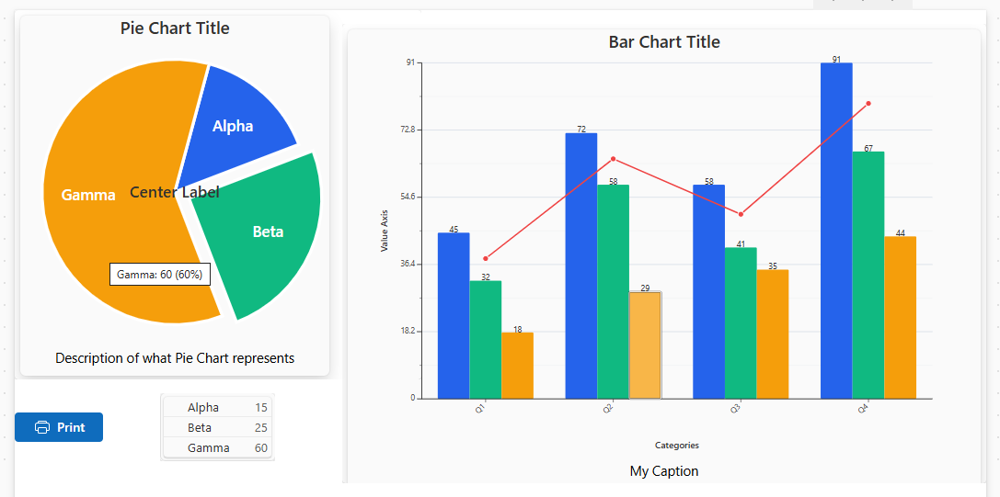

# PowerAppsChartComponents
yaml for Power App chart components

Currently supported are Pie charts (with some functionality towards gauge charts) and Bar charts (some support for grouped as stack, multi-column, and stacked with optional line segments).  Each draws the graph itself using SVG image (svg source of image available as property) with button overlay for interactivity including selecting slices and hover tooltips.  The pie is split into the pie chart and a legend.  The Legend output property of the pie can be used as the input Legend property for the legend component.  The bar chart still needs some work for its interactivity but supports multiple variations.  The interactive layer hides during printing so a clean chart is drawn for printing (such as saving to a pdf).  The graphs also support being printed to PDF using experimental PDF() function, but slow to generate PDF and result is fuzzy - better to Print() to pdf.  A sample screen is also provided showing both graphs.  See .  The file  provides an overview of how the pie chart buttons map to slices.
